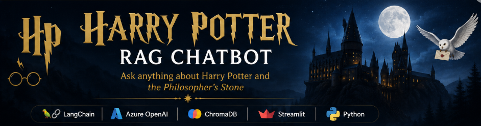
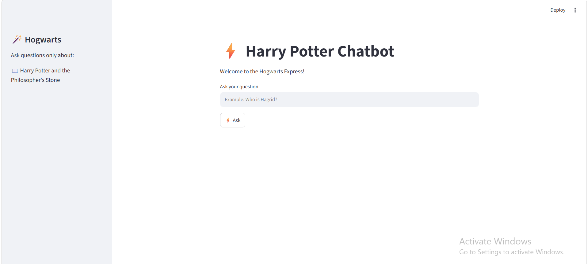
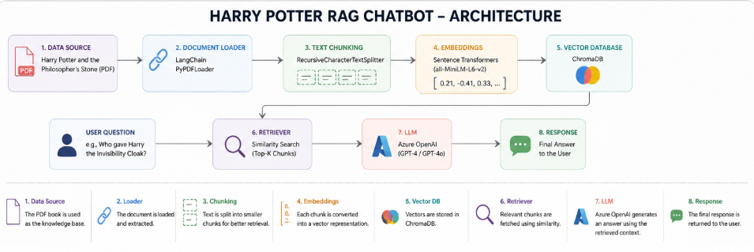

# 🧙 Harry Potter RAG Chatbot



A Retrieval-Augmented Generation (RAG) chatbot that answers questions about **Harry Potter and the Philosopher's Stone** using semantic search, LangChain, ChromaDB, Azure OpenAI, and Streamlit.

---

## 📌 Overview

This project uses Retrieval-Augmented Generation (RAG) to answer user queries based on the contents of the Harry Potter book. Instead of relying only on the LLM's knowledge, the chatbot retrieves relevant passages from the book and uses them to generate accurate, context-aware responses.

---

## ✨ Features

- 📖 Answers questions from the Harry Potter book
- 🔍 Semantic search using vector embeddings
- 🤖 AI-powered responses using Azure OpenAI
- 📚 PDF document ingestion
- 🧩 Intelligent text chunking
- ⚡ Fast retrieval using ChromaDB
- 🌐 Interactive web interface built with Streamlit

---

## 📸 Demo



---

## 🛠️ Tech Stack

- Python
- LangChain
- Azure OpenAI
- ChromaDB
- Sentence Transformers
- Streamlit
- python-dotenv

---

## 🏗️ Architecture



---

## 💬 Sample Questions

You can ask questions such as:

- Who is Rubeus Hagrid?
- Why did Harry live with the Dursleys?
- What is Platform 9¾?
- Who gave Harry the Invisibility Cloak?
- What happened when Harry first met Hagrid?
- What was Harry's first experience at Hogwarts?

---

## 📂 Project Structure

```text
harry-potter-chatbot/
│
├── data/
├── images/
│   ├── banner.png
│   ├── architecture.png
│   └── demo.png
├── scripts/
├── src/
├── app.py
├── test_embedding.py
├── test_llm.py
├── requirements.txt
├── .env.example
└── README.md
```

---

## 🚀 Installation

Clone the repository

```bash
git clone https://github.com/swassstiiiii/harry-potter-chatbot.git
```

Navigate to the project directory

```bash
cd harry-potter-chatbot
```

Create a virtual environment

```bash
conda create -n harryrag python=3.11
conda activate harryrag
```

Install the required dependencies

```bash
pip install -r requirements.txt
```

---

## 🔑 Environment Variables

Create a `.env` file in the project root and add your Azure OpenAI credentials.

```env
AZURE_OPENAI_API_KEY=your_api_key_here
AZURE_OPENAI_ENDPOINT=your_endpoint_here
AZURE_OPENAI_API_VERSION=your_api_version
AZURE_OPENAI_DEPLOYMENT_NAME=your_deployment_name
```

> Replace the variable names above with the ones used in your project if they are different.

---

## ▶️ Run the Application

Start the Streamlit application:

```bash
streamlit run app.py
```

Once the application starts, open the local URL displayed in your terminal (typically `http://localhost:8501`).

---

## 🚀 Future Improvements

- 📚 Support multiple Harry Potter books
- 💬 Add conversational memory
- 📖 Display retrieved source chunks in the UI
- 🔗 Show citations for generated answers
- ☁️ Deploy the application on Azure or Streamlit Community Cloud
- 🧪 Add automated unit and integration tests

---

## 📄 License

This project is for educational purposes only.

The Harry Potter book is copyrighted by J.K. Rowling and is **not included for redistribution**. Users should provide their own copy of the document when running this project.

---

## 👩‍💻 Author

**Swasti Jain**
